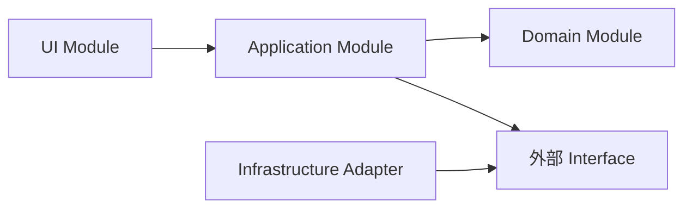
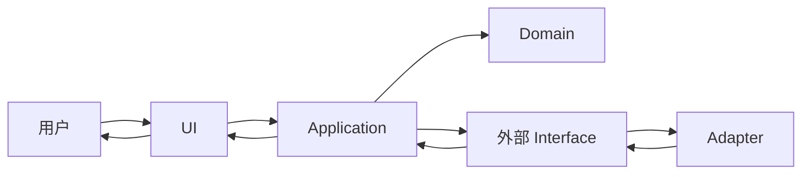

# ARCHITECTURE.md —— 当前架构契约

> 这是**按需文档**：只有项目已经出现多个长期 Module，并开始发生跨 Module 修改、状态互相改写或依赖方向说不清时才创建。
> 本文只写“当前架构是什么”。为什么这样选 → `docs/adr/`；Interface 字段与错误码 → `CONTRACT.md` 或代码 Interface；下游回归命令 → `REGRESSION.md`；知识入口 → `CLAUDE_MAP.md`。
> 所有内容必须来自真实 import、调用、注册、配置或状态写入证据；证据不足就标“未验证”，不要凭目录名补出一张完整图。

## 1. 架构摘要

用一到三句话说明当前架构的组织方式、最重要的单向依赖规则，以及这套结构保护什么。

## 2. Module 权责与状态归属

| Module | 唯一职责 | 拥有并修改的状态 | 对外 Interface | 允许依赖 | 禁止依赖 |
|---|---|---|---|---|---|
| UI | 接收输入、展示结果 | 页面临时状态 | `submit()` | Application | 数据库 Adapter、Domain 内部实现 |
| Application | 编排一次业务流程 | 当前任务状态 | `run()` | Domain、外部 Interface | UI |
| Domain | 执行核心业务规则 | 业务实体状态 | `decide()` | 无 | UI、基础设施实现 |
| Infrastructure | 接入数据库或外部系统 | 连接状态 | 实现对应 Interface | Domain 定义的 Interface | UI |

> 只登记真正需要协作者记住的关键 Module。共享可变状态只能有一个主要拥有者；其他 Module 通过 Interface 请求读写，不能越过 Interface 修改实现细节。

## 3. 代码依赖图

> 这里每条箭头只表示“左边代码依赖右边”，不是数据返回方向。返回结果可以反向流动，但代码依赖仍保持单向。每条边都要能指向真实证据。

## 4. 运行时核心流转图

> 这里的箭头表示运行时消息、数据或结果流转，不代表代码依赖。只画一到三条不直观的主链路，普通函数调用不要全部展开。

## 5. Interface 与 Adapter 证据

| Interface / Seam | 定义位置 | 调用方 | Adapter | 约束唯一来源 |
|---|---|---|---|---|
| 模型调用 Interface | `src/domain/model.py` | Application | `src/infrastructure/deepseek.py` | 代码 Interface |
| 对外数据 Interface | `CONTRACT.md` | UI | 后端路由 | `CONTRACT.md` |

> 只有确实存在多个实现或明确替换点时才登记 Adapter；不要为了图完整制造没有消费者的假 Seam。

## 6. 更新与验证

- 新增、删除、拆分或合并 Module → 同次改动更新权责表与两张图。
- 状态拥有者、Interface、允许/禁止依赖或核心流转改变 → 同次更新本文；若属于难回退选择，再新增或更新 ADR。
- 审计时抽查真实 import、调用、注册和状态写入；发现跨层直连、状态多头修改、绕过 Interface 或已删除 Module 仍留在图中，判为架构文档漂移。
- 本文过长时拆出下级架构文档，但本文件仍保留总图和索引；不要把细节塞回 `CLAUDE_MAP.md`。
